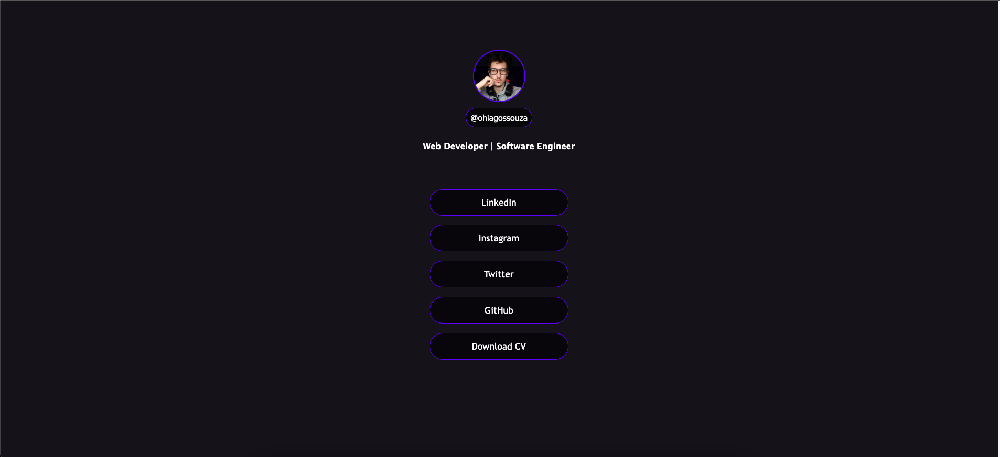
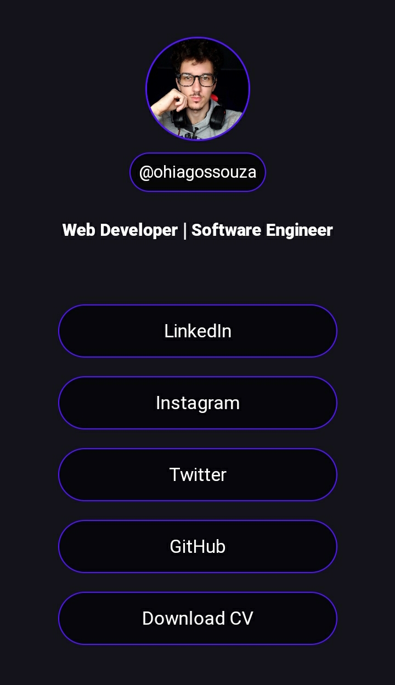

# Social media links

This is a simple social media links project (inspired on linktree)

## Screenshots

## Authors

| [ Hiago Souza](https://github.com/ohiagosouza) |
| :---: |
| [Linkedin](https://www.linkedin.com/in/ohiagosouza) |

## Stacks

  
  

                    